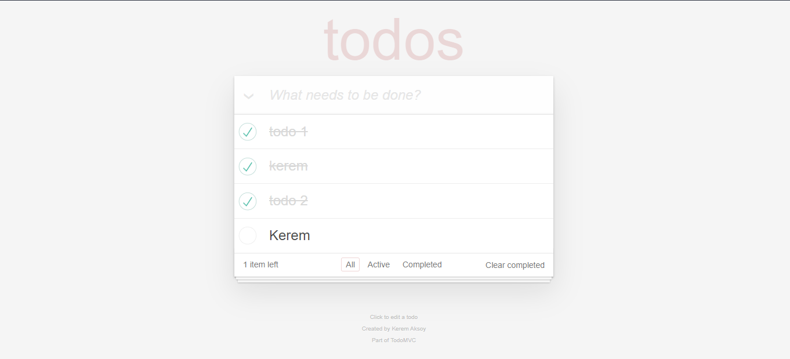
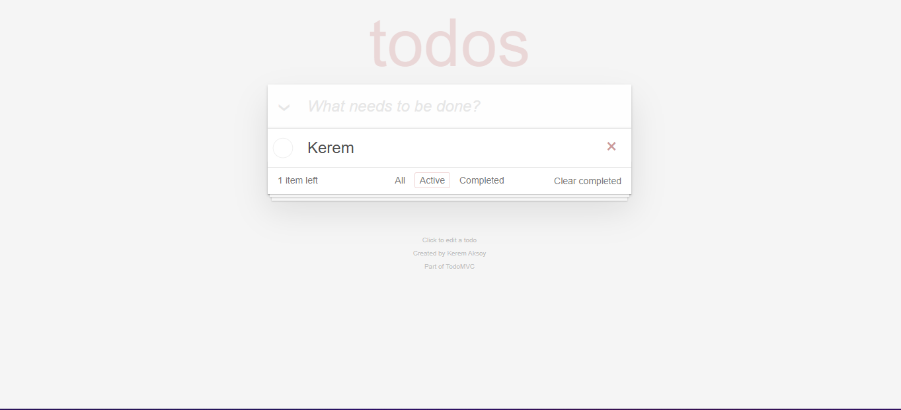
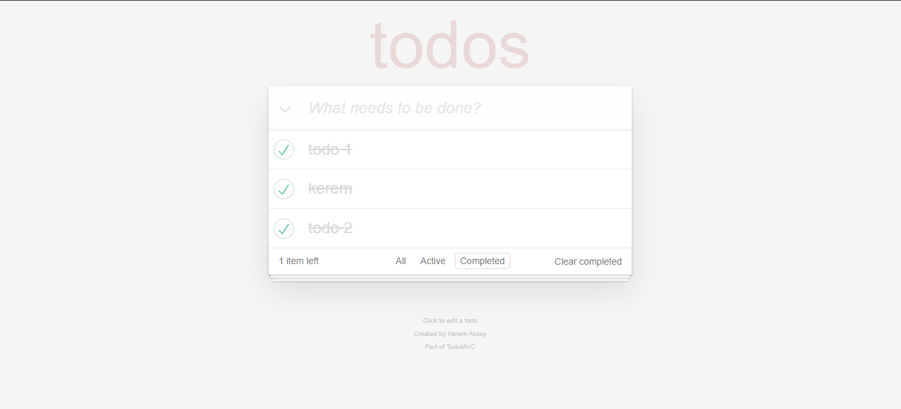
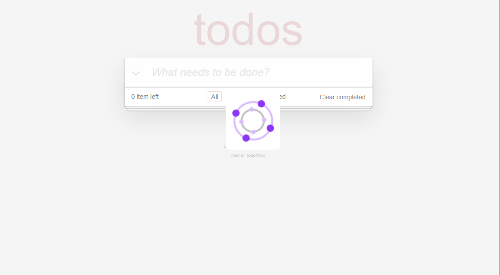
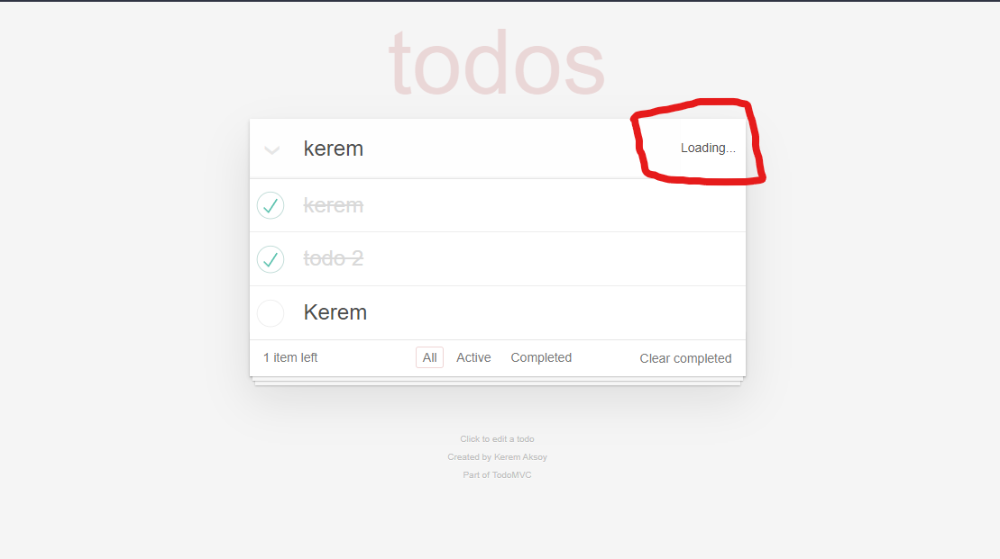

# Welcome My To-Do App 
## English Description
### I made this site to learn redux. It was a site where I did simple backend operations like Add - Delete - Update. I got the design part ready from the internet.
***
## Turkish Description
### Bu siteyi redux öğrenmek için yaptım. Ekleme - Silme - Güncelleme gibi basit arka uç işlemleri yaptığım bir siteydi. Tasarım kısmını internetten hazır olarak aldım.

# App Views
## All Todos Screen



## Active Todos Screen


## Completed Todos Screen


## Loading Todos Screen


## Add Todos Loading Screen


# For Download

```
https://github.com/KeremAksoy11/ToDoApp_Redux_with_Node
```